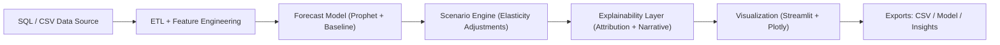

# ForecastFactory, AI-Driven Scenario Simulator

ForecastFactory is an advanced **AI-powered forecasting and simulation platform** built with **Python, Streamlit, Prophet, and SQLAlchemy**. It enables analysts, data scientists, and business strategists to **simulate business outcomes under different “what-if” scenarios**, allowing organizations not just to predict, but to *plan and adapt* intelligently.

---

## Project Overview

ForecastFactory bridges the gap between **data-driven forecasting** and **strategic scenario planning**. Traditional forecasting tools answer “what will happen,” while ForecastFactory explores **“what could happen”** under changing conditions like pricing shifts, ad budget changes, or supply constraints.

**Core Purpose:** Empower teams to **simulate future outcomes**, test assumptions, and quantify the effect of strategic decisions in real time.

---

## Business Goal

Most organizations rely on static forecasts that can’t adapt to real-world changes. ForecastFactory empowers them to:

* **Quantify trade-offs:** What if ad spend rises by 20%?
* **Stress-test assumptions:** How sensitive is revenue to a price increase?
* **Prepare for volatility:** What if demand drops due to supply shortages?

It transforms forecasting from passive prediction into **active decision simulation**.

---

## Key Features

* **AI Forecasting:** Prophet-based trend, holiday, and seasonality modeling.
* **Scenario Engine:** Interactive “what-if” analysis with domain-driven adjustments.
* **Elasticity Modeling:** Realistic impact simulation via custom elasticity coefficients.
* **SQL-Integrated Pipeline:** Seamlessly fetch data via SQLAlchemy.
* **Dynamic Visualization:** Real-time Plotly and Streamlit dashboards.
* **Explainability:** Automated narrative summaries for business interpretation.
* **Exportable Outputs:** Save data as CSV or Markdown reports.

---

## Architecture Overview



### Design Philosophy

The system is **modular and extensible**, enabling analysts to plug in new models or connect it to MLOps pipelines for continuous retraining.

---

## Technical Architecture

### 1. Data & SQL Layer

* **SQLite** used for quick prototyping, extensible to PostgreSQL or Snowflake.
* **SQLAlchemy ORM** provides seamless connection and schema management.
* Data cleaned and aggregated via Pandas ETL transformations.

### 2. Forecast Engine

* Powered by **Prophet**, modeling seasonality, trend, and holiday effects.
* Fallback to **Moving Average** for baseline comparison.
* **Backtesting pipeline** validates performance via MAE, RMSE, and SMAPE.

### 3. Scenario Engine

* Defines relationships such as:

  * `ΔQ/Q = ε × ΔP/P` (Price elasticity)
  * `Uplift = α × log(1 + β × AdSpend)` (Media response)
  * `Q' = Q × (1 + γ × PromoFlag)` (Promotion effects)
* Produces **differential forecasts** showing net impact vs baseline.

### 4. Visualization Layer

* Streamlit powers the interactive UI.
* Plotly renders visual insights with interactivity and real-time updates.
* Exports available in CSV format for further analysis.

### 5. Explainability Module

* Integrates Prophet component decomposition and SHAP-like narratives.
* Generates business-oriented insights:
  *“Increased ad spend drove +7.8% uplift over baseline between July-August.”*

---

## Screenshots

### ForecastFactory Home


*Define the data source, KPI, and forecast horizon.*

---

### Baseline Forecast


*Displays Prophet-based forecasts with confidence intervals.*

---

### Scenario Builder


*Interactively tweak ad spend, pricing, or promotions to simulate impact.*

---

### Delta Analysis


*Visualize baseline vs simulated outcomes, with quantified uplift metrics.*

---

## Case Study, *E-commerce Demand Simulation*

**Objective:** Forecast 90 days of revenue while simulating increased ad spend and promotions.

1. **Baseline:** Prophet trained on 2 years of revenue data.
2. **Scenario:** +15% ad spend, 10% promotion activation.
3. **Elasticity Equations:**

   * Ad response = 0.3 × log(1 + 0.001 × spend)
   * Promo uplift = +6%
4. **Result:** +8.7% projected uplift vs baseline; ±2.3% confidence margin.
5. **Insight:** The simulator suggested that moderate ad increases yield diminishing returns after 15% budget growth.

---

## Directory Structure

```
forecastfactory/
│
├── app.py                   # Streamlit main interface         
├── db/
│   ├── schema.sql           # Database schema
│   └── seed.sql             # Sample data
├── forecastfactory
│   ├── __init__.py
│   ├── elasticity.py
│   ├── explain.py
│   ├── features.py
│   ├── io_sql.py
│   ├── models.py 
│   ├── scenario.py
│   └── viz.py
├── config.yaml              # Configuration
└── requirements.txt         # Dependencies

```

---

## Technical Appendix

### Forecasting Metrics

| Metric    | Formula      | Description             |
| --------- | ------------ | ----------------------- |
| **MAE**   | Σ            | y−ŷ                     |
| **RMSE**  | √Σ(y−ŷ)² / n | Penalizes larger errors |
| **SMAPE** | (200/n) Σ    | y−ŷ                     |

### Elasticity Equations

* **Price Elasticity:** ΔQ/Q = ε × ΔP/P
* **Media Response:** Uplift = α × log(1 + β × AdSpend)
* **Promo Effect:** Q’ = Q × (1 + γ × PromoFlag)

### Database Schema

| Table                | Description                       |
| -------------------- | --------------------------------- |
| `fact_kpi_daily`     | KPI value by day                  |
| `fact_drivers_daily` | Drivers (price, ad spend, promo)  |
| `dim_calendar`       | Holidays and day-of-week metadata |

---

## Setup Instructions

```bash
git clone https://github.com/AmirhosseinHonardoust/Forecast-Factory.git
cd ForecastFactory
pip install -r requirements.txt
streamlit run app.py
```

If Prophet is missing:

```bash
pip install prophet pystan==2.19.1.1
```

Database initialization:

```bash
python -m forecastfactory.cli init
```

---

## Business Applications

| Sector         | Example Use Case                                 |
| -------------- | ------------------------------------------------ |
| **E-commerce** | Predict sales under different promo policies     |
| **Marketing**  | Simulate ROI of ad budget increases              |
| **Finance**    | Stress-test revenue against macroeconomic shocks |
| **Retail**     | Optimize stock levels under demand uncertainty   |
| **Operations** | Forecast capacity or workforce requirements      |

---

## Future Enhancements

* Integrate **XGBoost** and **LSTM** for hybrid forecasting.
* Introduce **AutoML model selection** and backtesting reports.
* Add **multi-scenario comparison** (budget vs promo vs combined).
* Implement **role-based dashboards** with Streamlit authentication.
* Export results to **Power BI or Google Data Studio**.
* Connect to **real-time APIs** for adaptive forecasting.

---

## References & Attributions

* [Prophet Documentation](https://facebook.github.io/prophet/docs/quick_start.html)
* [XGBoost Docs](https://xgboost.readthedocs.io/en/stable/)
* [Streamlit API Reference](https://docs.streamlit.io/)
* [Plotly Python Library](https://plotly.com/python/)
* [SQLAlchemy ORM](https://docs.sqlalchemy.org/)
* [SHAP Framework](https://shap.readthedocs.io/)

---

## Conclusion

**Forecast-Factory** transforms forecasting into a dynamic, interactive experience that merges **machine learning, simulation, and human insight**.
It’s a platform where analysts don’t just observe the future, they **shape it through data-driven experimentation**.
